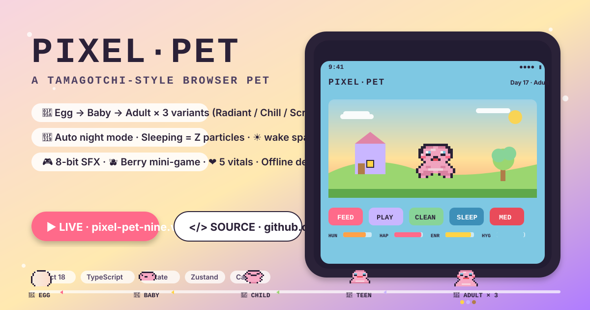

# 🥚 Pixel Pet · MODEL PP-01

A hand-held, pixel-art Tamagotchi-style browser portfolio. Your pet hatches from an egg, grows through 5 life-stages with 3 adult variants, and tells you exactly how it feels — stats decay in real time (or via 72-hour offline catch-up), day/night cycles paint the scene, and a rAF 60fps canvas renders every pixel.

## ✨ Features

- 🐣 **Growth lifecycle** — Egg → Baby → Child → Teen → Adult (3 variants: Radiant / Chill / Scruffy)
- 🎯 **5 needs** — Hunger, Happiness, Energy, Hygiene, Health with hourly decay, health guards, hourly pet-stroke cap
- 🍚 **Feed meal/snack**, 🛁 Clean, 😴 Sleep (triple-click 1.2s wake), 💊 Medicine (when sick), 🫶 Pet strokes (capped 20/hr)
- 🫐 **Catch-the-Berries mini-game** (Press **P**) — 15s falling berries, 3 scoring tiers, bonus happiness
- 🌅 **Day/Night 4-phase world** — dawn / day / dusk / night with sky gradients, sun/moon arcs, twinkle stars, fireflies, clouds, house, tree
- 💥 **Particle pool** (N=224) with 9 hand-drawn sprite kinds — hearts, crumbs, bubbles, zzz, sparkles, stink, tears, stars, butterflies
- ⏪ **Offline catch-up** up to 240h in 1-minute quanta with human-readable toast
- 💾 **Zustand persist** with JSONStorage safe try/catch, versioned migrations (v1 → v2)
- ⚡ **XState v5** state machine — egg wobble/crack/hatch, alive awake/asleep/sick parallel states, evolving transient
- 🔊 **8-bit Web Audio SFX** — feed chime, play arpeggio, clean splash, sleep whoosh, hatch jingle, evolve spark, refuse blip, hungry warning, stroke tick, toast ping, medicine, berry catch
- 🫧 **Pixel sprites** — 6 hand-drawn character stages × 13 animations (idle / happy / eating / playing / sleeping / hungry / sad / sick / dirty / pet / refuse / clean / blink) with 19-color PALETTE + tinted offscreen sprite cache
- 🧠 **Rolling 14-day care score** → adult variant selection
- ♿ **Accessible** — landmarks (`<main>`, `<aside>`, `role="dialog"`, `aria-modal`), sr-only live region, `role="status"` toasts, Esc closes modals, Escape+backdrop click for Settings & BerryGame, prefers-reduced-motion respected
- 🎞️ **Reduced motion** — CSS media query kills animations (0.001ms), JS hook disables Framer Motion `initial` + `whileHover` / `whileTap`, PetCanvas breathingBob drops from 1.2 → 0.5
- 🌗 **Tab title + favicon moods** — egg 🥚 → hatching 🐣 → 😊 happy / 😋 eating / 😴 sleeping / 😢 sad / 🤒 sick / 😣 hungry / 💚 great with tinted 16×16 SVG pixel pet favicon
- 🎛️ **Dev controls** — time speed 1×/10×/60×/600×, skip next stage, force night, set all stats low, make sick, reset progress (hold 3s), Ctrl+Alt+D toggles machine debug

## 🧱 Tech stack

| Layer      | Stack                                                                 |
|------------|-----------------------------------------------------------------------|
| Bundler    | Vite 5 + React 18 + TypeScript strict                                |
| State      | Zustand persist store + XState v5 actor via `usePetActor` Provider   |
| UI         | Tailwind + Framer Motion overlays + Press Start 2P + Nunito          |
| Render     | HTML Canvas 2D pixel-art sprites, DPR setTransform, offscreen cache  |
| Particles  | Fixed-pool N=224, `_firstFree` head, 9 sprite kinds                  |
| Audio      | Web Audio API `OscillatorNode` + `BiquadFilter` chiptune SFX (Howler in package.json) |
| Test       | Vitest 2 + jsdom — 27 unit tests across stats/actions/offline/careScore |
| Deploy     | Vercel (`vercel.json` framework: vite, npm ci, dist output)          |

## 🚀 Quick start

```bash
npm ci
npm run dev    # http://localhost:5178
npm run test   # 27/27 vitest
npm run build  # 446 modules → ~131KB gzipped
```

## ⌨️ Shortcuts

| Key                 | Action                                  |
|---------------------|-----------------------------------------|
| `F`                 | Feed a meal (popover picks Meal/Snack)  |
| `P`                 | Play — open Catch-the-Berries mini-game |
| `C`                 | Clean (cooldown applies)                |
| `S`                 | Sleep/Wake (wake = 3 clicks in 1.2s)    |
| `Esc`               | Close Settings / BerryGame              |
| `Ctrl`+`Alt`+`D`    | Toggle XState machine debug overlay     |

## 🏗️ Architecture

```
 ┌──────────────────────────────────────────────────────────┐
 │                       React Tree                         │
 │  App → AppInner → DeviceShell → PetCanvas (Canvas 2D)    │
 │           ↳ Header / StatsPanel / Toasts / SettingsPanel │
 │           ↳ ActionButtons / BerryGameModal / Keyboard…   │
 │           ↳ SfxSubscriber / TitleFaviconSubscriber       │
 └──────────────┬────────────────────────────────┬──────────┘
                │                                │
   Zustand persist store (v2, migrateFromAny)   │
   usePetStore.ts (tick 1Hz actions, play/feed…) │
                │                                │
   zustand setMachineEventSink ⇄ XState v5 actor│
                │                                │
   src/machines/petMachine.ts (egg / alive      │
   awake.asleep.sick parallel / evolving trans) │
                │                                │
   Pure game modules: stats.ts / actions.ts     │
   offline.ts / careScore.ts / decay.ts         │
   constants.ts (EGG_DURATION, STAT_*, etc.)    │
                │                                │
   Canvas pipeline:                              │
   PetCanvas → bundleFor(stage, variant)        │
   renderSprite (offscreen char→palette cache)  │
   ParticleSystem pool / drawBackground         │
   dayNight paletteForHour(h, forceNight?)      │
                │                                │
   Sprites (string[] → pal[ch]): egg/baby/child │
   teen / adult-{radiant,chill,scruffy} × 13    │
   animations, eyeSlots → pupil lerp cursor     │
```

### Growth life-stage durations

| Stage  | Real-time age (after egg hatch) |
|--------|----------------------------------|
| Egg    | 60 s real time (scaled by Time Speed) |
| Baby   | 0–24 h                           |
| Child  | 24–72 h                          |
| Teen   | 72–144 h                         |
| Adult  | ≥ 144 h (permanent; Radiant ≥ 80 / Chill 50–79 / Scruffy < 50 care avg) |

## 🧪 Testing

- `src/game/stats.test.ts` — makeStats, clampStat/roundStat, decayStats minute-by-minute
- `src/game/actions.test.ts` — feed meal/snack, play(score), clean, toggleSleep, giveMedicine, petStroke 20/hr cap
- `src/game/offline.test.ts` — 72-hour catch-up quanta, sleep recovery, capped 240h
- `src/game/careScore.test.ts` — lifeStageFromAge, adultVariantFromCareScore rolling avg

```bash
$ npm run test
 ✓ 4 test files
   27 tests passed
```

## ♿ Accessibility

- **Landmarks**: `<main>` page, `<aside aria-label="Pet stats">`, Stats mobile region `role="region" aria-label="Pet vitals"`
- **Modals**: Settings + BerryGame both have `role="dialog" aria-modal="true"` + labelled aria-labels; backdrop click + Esc close
- **Live region**: `A11yLiveRegion` (sr-only `aria-live="polite"` debounced 1.5s) + Toasts `role="status"`
- **Reduced motion**: `(prefers-reduced-motion: reduce)` CSS sets 0.001ms all anims + transition; `usePrefersReducedMotion()` disables Framer `initial`, `whileHover`, `whileTap`; PetCanvas breathingBob drops amplitude
- **Keyboard**: All 4 actions + `Esc` + machine debug toggle; RoundButtons carry `aria-label` with hotkey hints + disable reasons (e.g. "Pet is too tired (energy < 15)")

## 🗂️ License / structure

Hand-built without scaffolding tools (create-vite hung on this machine; all config / src / tests hand-scaffolded).

```
Pixel Pet
├── index.html, vercel.json, vite.config.ts, tsconfig*.json, tailwind.config.js, postcss.config.js
├── package.json
├── public/favicon.svg
├── src/
│   ├── main.tsx, App.tsx, styles/index.css
│   ├── hooks/ — useAnimation, useCursor, useGameLoop, usePrefersReducedMotion, useTimeSpeed
│   ├── components/ — ActionButtons, DeviceShell, Header, MachineDebug, PetCanvas, SettingsPanel, StatsPanel, Toasts
│   ├── store/ — usePetStore.ts (Zustand persist), usePetActor.tsx (XState provider + bridge)
│   ├── machines/petMachine.ts (XState v5 setup)
│   ├── game/ — constants, stats, actions, offline, decay, careScore
│   ├── scene/ — background + dayNight palette
│   ├── sprites/ — palette, renderSprite, egg/baby/child/teen/adult-radiant/adult-chill/adult-scruffy, effects
│   ├── particles/ — particleSprites, ParticleSystem (pool N=224)
│   └── sounds/sfx.ts (Web Audio 8-bit code-gen)
└── tests/ — stats, actions, offline, careScore (vitest, jsdom)
```

Happy hatching! 🥚✨

## 🎨 Portfolio / social assets

Use these hand-made SVGs to link from your portfolio, LinkedIn, X/Twitter, Notion, or personal site. Files live in `portfolio/` (push this folder to GitHub so the links resolve).

### 1. Large thumbnail (1200×630, opengraph/OG size — portfolio hero, cards, tweets)

**File:** `portfolio/pixel-pet-thumbnail.svg`

✅ Shows device mockup, stage strip (🥚 Egg → Baby → Child → Teen → Adult ×3), action buttons, vitals bars, LIVE + SOURCE clickable pill buttons that go straight to your app.

**Markdown (paste into README / Notion / LinkedIn post):**

```md
[](https://pixel-pet-nine.vercel.app/)
```

**HTML (paste into a portfolio website):**

```html
<a href="https://pixel-pet-nine.vercel.app/" target="_blank" rel="noopener noreferrer">
  
</a>
```

### 2. Animated banner (900×280 — inline portfolio/project card, CSS animations)

**File:** `portfolio/pixel-pet-banner-animated.svg`

✅ Clickable `<svg onclick="window.open(...)">` → opens `pixel-pet-nine.vercel.app` in a new tab.
✅ CSS-only animations (no JS): pet bob, eyelids blink, floating Z letters, sparkle pulse, shiny shine sweep on the PLAY pill.
✅ Honors `prefers-reduced-motion` → all animations pause automatically.

**Markdown (GitHub README / Notion — GitHub sanitizes onclick, so wrap in <a>):**

```md
[](https://pixel-pet-nine.vercel.app/)
```

**HTML for your personal portfolio (keeps the inline onclick jump):**

```html
<object
  type="image/svg+xml"
  data="portfolio/pixel-pet-banner-animated.svg"
  width="900"
  height="280"
  style="max-width:100%; height:auto; border-radius: 16px;"
>
  <a href="https://pixel-pet-nine.vercel.app/" target="_blank" rel="noopener noreferrer">
    Pixel Pet · Virtual browser pet — play live
  </a>
</object>
```

### 3. GitHub social preview (Settings → Social preview)

Go to your repo → **Settings** → **General** → **Social preview** → **Edit** → Upload the thumbnail SVG (or export the 1200×630 SVG to PNG via browser "Open image → Save as PNG"). Done — now anyone pasting your GitHub link on Discord / Slack / X / LinkedIn gets a beautiful preview.

### Quick: make the SVGs reachable from anywhere

```bash
cd "/Users/lalit/lalit/Pixel Pet"
git add portfolio/ README.md
git commit -m "docs: add portfolio thumbnail + animated banner SVGs linking to Vercel"
git push
```

Then reference them by raw GitHub URL (works anywhere) if you don't want to copy the files into the portfolio repo:

```
https://raw.githubusercontent.com/laleet008/pixel-pet/main/portfolio/pixel-pet-thumbnail.svg
https://raw.githubusercontent.com/laleet008/pixel-pet/main/portfolio/pixel-pet-banner-animated.svg
```

